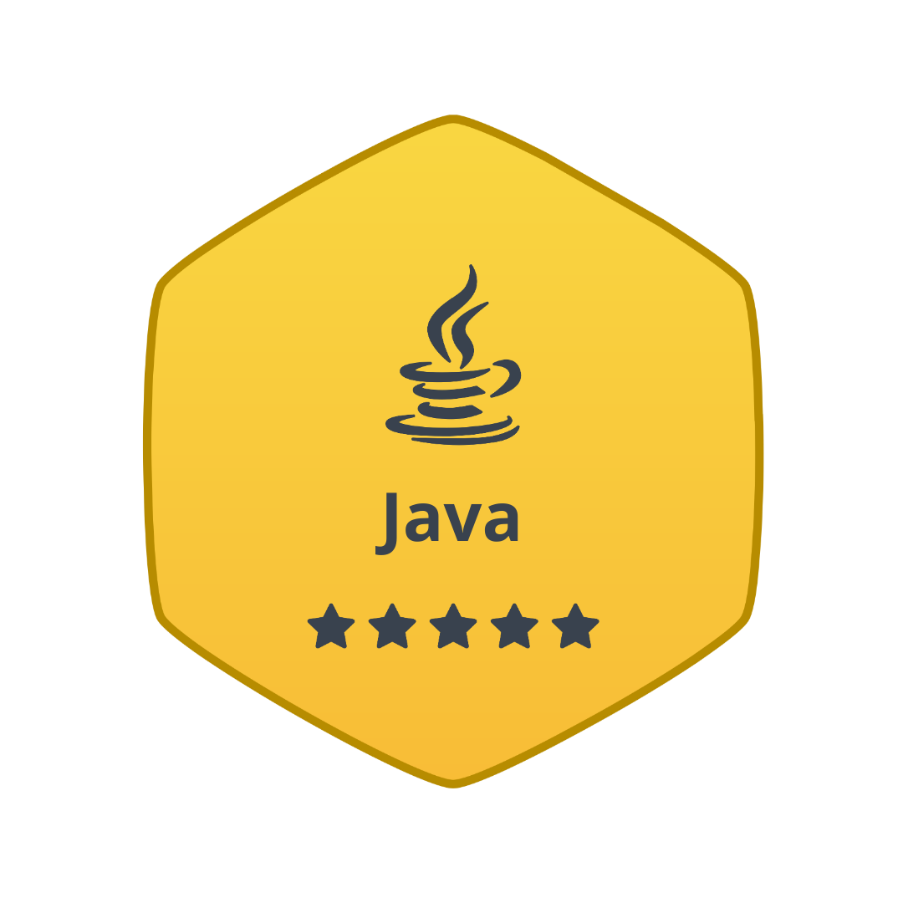

# AsperTheGhost

**`A Passionate Future Software Engineer`**

An **Aspiring Software Engineer** driven to transform complex problems into bold, innovative solutions. Passionate about **software development, system design, and AI**. I strive not just to learn, but to excel, create, and leave a lasting mark. I also do weapon arts, collecting certificates, cooking, volunteer work, and learning more things as a hobby. If you want to collab, kindly contact me! (Btw, this is a new account that I recently worked on again after my old one got lost)

 
 
 

##  GitHub Stats:

  
  
  
  
  
  
  
  
  
  
  
  
  
  
  
  
  
  
  
  
  
  
  

  
  
  

  
  

## Tech Stacks

Other Tech Interest 

 

   

