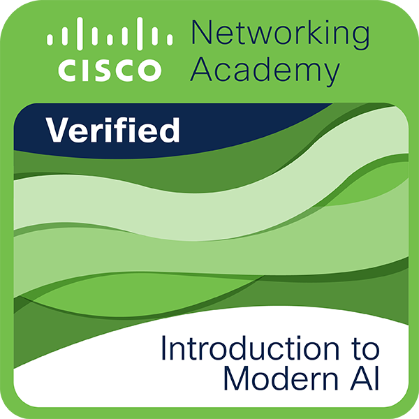

# AsperTheGhost

**`A Passionate Future Software Engineer`**

An **Aspiring Software Engineer** driven to transform complex problems into bold, innovative solutions. Passionate about **software development, system design, and AI**. I strive not just to learn, but to excel, create, and leave a lasting mark. I also do weapon arts, collecting certificates, cooking, volunteer work, and learning more things as a hobby. If you want to collab, kindly contact me!

 
 
 

##  GitHub Stats:

  
  
  
  
  
  
  
  
  
  
  
  
  
  
  
  
  
  
  
  
  
  

  

    
  

## Tech Stacks

### Main Stack 

## Programming Technologies in the Past

### 🖥️ Programming Languages

### 🗄️ Databases

### 🧩 Frameworks & Libraries

### ⚙️ Tools & Platforms

### 🎨 UI / Design

## 🐧 OS / Environments

 

    
   

